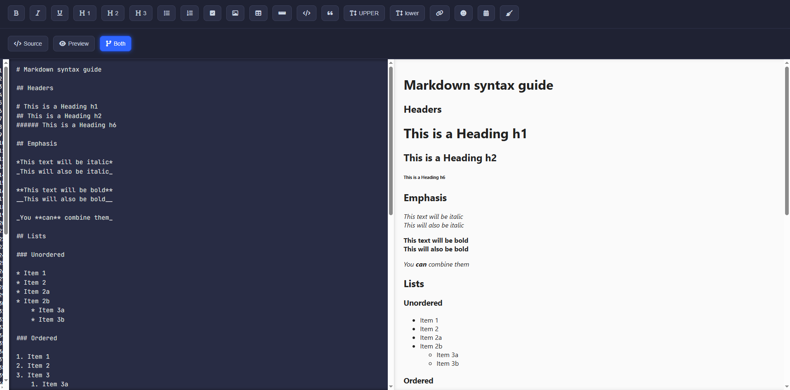

````markdown
---
# Markdown Typescript

A simple and efficient Markdown editor, made with Typescript, focused on a clean interface and practical features for editing and viewing in real time.

---

## 🚀 Features

- Editor with Markdown support.
- Real-time preview.
- Buttons to insert common Markdown tags (bold, italic, lists, etc.).
- View modes: Source, Preview and Both.
- Quick insertion of emojis, links, tables and code.
- Support for scroll synchronization between editor and preview.

---

## 💻 Installation

1. Clone this repository:

```bash
git clone https://github.com/luigi043/markdown-typescript.git
````

2. Navigate to the project folder:

```bash
cd markdown-typescript
```

---

## 🎯 Usage

* Use the toolbar buttons to insert Markdown tags.
* Toggle between Source, Preview, and Both modes.
* Edit text in the editor and see an instant preview.

---

## 🤝 How to Contribute

Contributions are welcome! To contribute:

1. Fork this repository.
2. Create a branch for your feature (`git checkout -b my-feature`).
3. Commit your changes (`git commit -m 'My new feature'`).
4. Push it to your fork (`git push origin minha-feature`).
5. Open a Pull Request here in the original repository.

---

## 📄 License

MIT — feel free to use, modify, and share this project.

---

## 👤 Author

**Luiz**

Built with a passion for cars, code, and clean UI.
[GitHub](https://github.com/luigi043) | [Twitch](https://twitch.tv/luigi_043_) | [Instagram](https://instagram.com/luigi_043_)

---
```

```